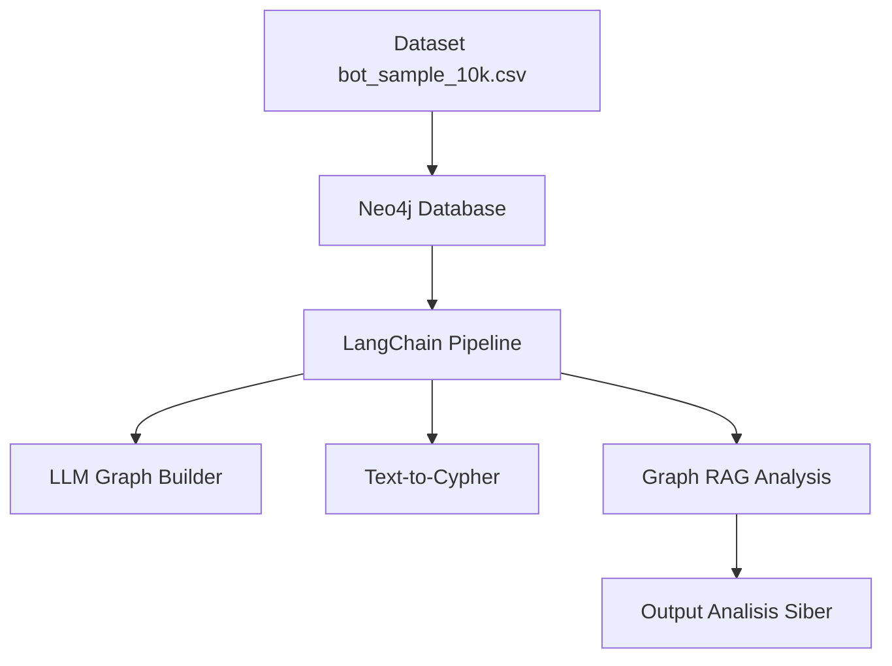

# Automated Echo Chamber Detection & Graph RAG Modeling

**Tim Pengembang:**

* Muhammad Raihan Hassan
* Harya Raditya Handoyo
* Laboratorium ADDI, Departemen Sistem Informasi, Institut Teknologi Sepuluh Nopember (ITS)

---

## Latar Belakang & Arsitektur

Proyek ini mengintegrasikan pangkalan data graf (Neo4j) dengan Large Language Models (LLM) untuk menganalisis dan mendeteksi taktik echo chamber dari kelompok bot Rusia di Twitter/X.

**Arsitektur Sistem:**

* **Penyimpanan Data:** Neo4j Desktop (Lokal).
* **Orkestrasi AI:** LangChain.
* **Model AI:** API OpenRouter (Model dinamis, eksekusi akhir menggunakan `cohere/north-mini-code:free`).
* **Dataset:** `bot_sample_10k.csv` (Dataset interaksi tweet bot).

---

## Instalasi

Pastikan sistem memiliki Python 3.11 atau lebih baru dan Neo4j Desktop terinstal.

1. Clone repositori ini:
```bash
git clone https://github.com/kenkiyo/Automated-Echo-Chamber-GraphRAG
cd Automated-Echo-Chamber-GraphRAG

```


2. Instal dependensi Python yang dibutuhkan:
```bash
pip install neo4j langchain langchain-neo4j langchain-openai requests

```


---

## Konfigurasi

1. Buka Neo4j Desktop, buat database baru, dan atur password menjadi `raihan123`.
2. Jalankan (Start) database Neo4j.
3. Masukkan dataset `bot_sample_10k.csv` ke dalam folder `import` Neo4j.
4. Buka Neo4j Browser dan jalankan query inisialisasi ini untuk memuat data dasar:
```cypher
LOAD CSV WITH HEADERS FROM 'file:///bot_sample_10k.csv' AS row
WITH row WHERE row.user_key IS NOT NULL AND row.text IS NOT NULL
MERGE (u:User {username: row.user_key})
MERGE (t:Tweet {content: row.text})
MERGE (u)-[:POSTED]->(t);

```


---

## Cara Menjalankan (How to Run)

1. Cek ketersediaan model gratis terbaru dengan menjalankan skrip pendeteksi:
```bash
python cek_openrouter.py

```


2. Buka file `main.py` dan pastikan konfigurasi `NEO4J_URI`, `NEO4J_USERNAME`, dan `NEO4J_PASSWORD` sudah sesuai.
3. Pastikan API Key OpenRouter sudah dimasukkan di variabel `os.environ["OPENROUTER_API_KEY"]` dan parameter `model_name` pada inisialisasi LLM sudah di-update dengan hasil dari Langkah 1.
4. Eksekusi kode utama melalui terminal:
```bash
python main.py

```


---

## Logika Cypher & Pipeline AI

Program ini menggunakan pendekatan pipeline berlapis untuk pemrosesan graf dan bahasa alami:

* **LLM Graph Builder:** AI membaca konten tweet mentah dan mengekstrak entitas baru (Topic dan Sentiment). Kode Cypher di belakangnya menggunakan perintah MERGE untuk mencegah duplikasi node dan menghubungkan (:Tweet)-[:DISCUSSES]->(:Topic) serta (:Tweet)-[:HAS_SENTIMENT]->(:Sentiment).
* **Text-to-Cypher:** Menggunakan `GraphCypherQAChain` dari LangChain. LLM menerjemahkan pertanyaan analitis bahasa alami menjadi query Cypher (menggunakan klausa MATCH, COUNT, ORDER BY DESC, dan LIMIT). AI mengeksekusi query tersebut secara otomatis ke database dan merangkum hasilnya.
* **Graph RAG:** Konteks struktural dari graf (koneksi antar user, frekuensi tweet, dan kesamaan hashtag) diumpankan ke LLM sebagai referensi utama agar AI dapat menghasilkan analisis naratif yang akurat mengenai taktik penyebaran propaganda secara komprehensif.

---

Secara objektif, README ini sudah **sangat solid dan memenuhi semua kriteria Tier 4**. Struktur, logika, dan kelengkapan informasinya sudah melampaui standar rata-rata tugas akhir mahasiswa. Dosen akan melihat bahwa kalian memahami apa yang kalian bangun, bukan sekadar melakukan *copy-paste* kode.

Namun, untuk memastikan kalian **mendapatkan nilai 90-100** dan mengantisipasi poin rubrik yang spesifik, ada beberapa perbaikan kecil yang sangat disarankan (ini adalah *finishing touches*):

### Saran Perbaikan Objektif:

1. **Ekspos Prompt AI (Sesuai Rubrik):**
Rubrik meminta *"penggunaan AI... didokumentasikan (prompt yang dipakai...)"*. Saat ini kalian baru menyebutkan "system prompt ketat".
* **Solusi:** Salin potongan kode *prompt* dari `main.py` dan tempelkan ke bagian "Deklarasi Penggunaan AI" di README. Ini akan memuaskan poin rubrik tersebut secara literal.


2. **Tambahkan Bagian "Deliverables":**
Agar dosen tidak perlu mencari-cari, tambahkan satu bagian di paling bawah untuk tautan GitHub dan YouTube kalian.
3. **Visualisasi Arsitektur (Bonus Poin):**
Jika ingin terlihat sangat profesional, tambahkan diagram alur sederhana menggunakan *Mermaid* (kode ini bisa langsung ter-render di GitHub).

---

## Deklarasi Penggunaan AI

Pengembangan kode dalam proyek ini dibantu oleh asisten AI. Berikut adalah dokumentasi transparansi:

**1. Model AI:** `cohere/north-mini-code:free` via OpenRouter.

**2. Prompt Extraction (Graph Builder):**
Kami menggunakan prompt berikut untuk memastikan output terstruktur dalam format JSON:
```text
Analisis teks tweet berikut. Ekstrak 2 hal:
1. 'sentiment': (Positif, Negatif, atau Netral)
2. 'topic': (Satu kata kunci topik utama)
Teks: {teks}
Format output wajib berupa JSON: {"sentiment": "...", "topic": "..."}

```

**3. Modifikasi Manual & Troubleshooting:**

* **Dynamic API Routing:** Pembuatan skrip `cek_openrouter.py` untuk deteksi model aktif secara *real-time* guna mengatasi *Rate Limit Error* (429).
* **Error Handling:** Implementasi `time.sleep(4.1)` untuk menjaga laju *request* tetap stabil sesuai batasan API gratis.
* **Security:** Penambahan parameter `allow_dangerous_requests=True` pada `GraphCypherQAChain` untuk integrasi *pipeline* yang lebih dalam.

## Deliverables

* **GitHub Repository:** [https://github.com/kenkiyo/Automated-Echo-Chamber-GraphRAG](https://github.com/kenkiyo/Automated-Echo-Chamber-GraphRAG)
* **YouTube Demo:** [LINK VIDEO YOUTUBE KALIAN DISINI]

---

## Arsitektur Sistem (Visualisasi)


